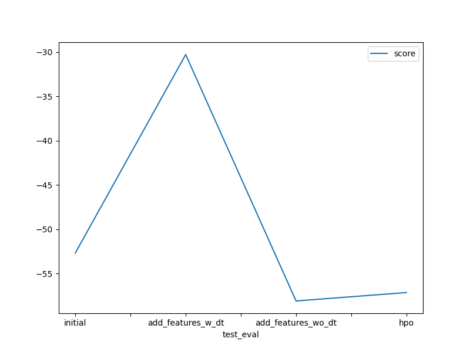
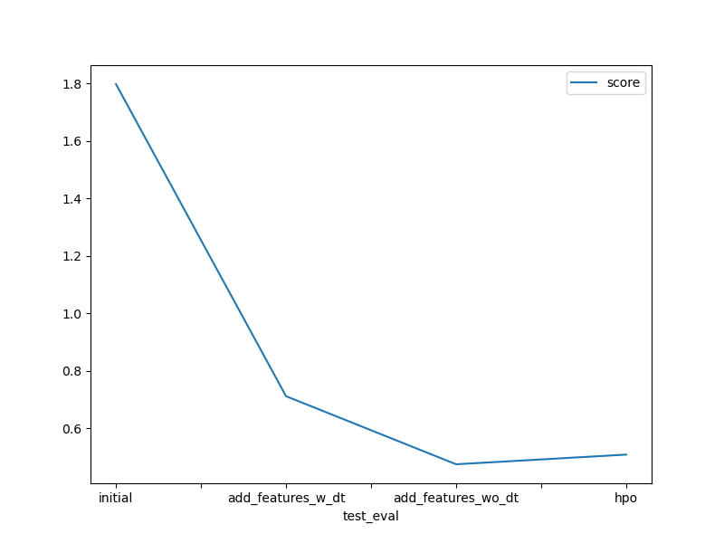

# Report: Predict Bike Sharing Demand with AutoGluon Solution
#### Sven Mentl

## Initial Training

### What did you realize when you tried to submit your predictions? What changes were needed to the output of the predictor to submit your results?

The output of the predictor contains only the predicted values, i.e. the count. In order for Kaggle to score our submission we need to provide the features with the corresponding predicted count, so that Kaggle can calculate the error.
Instead of providing all features it is sufficient to provide the datetime per score. With the datetime, which serves as an ID, Kaggle knows the features.

| | datetime | count |
|---|---|---|
| 1 | 2011-01-20 00:00:00| predicted count |
| 2 | 2011-01-20 01:00:00| predicted count |
| ... | ... | predicted count |

As suggested in the notebook, we checked for negative values, but there was none.

### What was the top ranked model that performed?

Best model was `WeightedEnsemble_l3` with a score of 1.79693.

## Exploratory data analysis and feature creation
### What did the exploratory analysis find and how did you add additional features?

Derived from the `datetime` feature I added 3 new categorical features
* `dayofweek`: The day of the week with Monday = 0, Sunday = 6
* `hour`: The hour of day from 0 to 24
* `month`: the month with January = 1, December = 12

### How much better did your model preform after adding additional features and why do you think that is?

I then tested two different set of features.

* The features used for initial training with my 3 additional features keeping the feature `datetime`. The model is shown as `add_features_w_dt` in the below graps. The best model is `WeightedEnsemble_L3` with a `score_val` of `-30.278699` and a Kaggle score of `0.71161`.
* The features used for initial training with my 3 additional features removing the feature `datetime`. The model is shown as `add_features_wo_dt` in the below graps. The best model is `WeightedEnsemble_L3` with a `score_val` of `-58.099869` and a Kaggle score of `0.47489`

My rationale was that no two observations share the same `datetime` and therfore it would not be helpful for prediction. I later then learned that AutoGluon itself derives adds additional features from `datetime`. Although the validation score of `add_features_w_dt` is higher `add_features_wo_dt` performs quite a lot better on the test data.

By looking at the problem my assumption would have been that during night hours and during winter months fewer people are renting bikes. With the added features the model is able to differentiate between night and day and winter and summer.

This information however is partially already captured by the features `season` and `workingday` so it is not completely new to the model.

## Hyper parameter tuning

### How much better did your model preform after trying different hyper parameters?

Actually it did not, the score went down to 0.50844 (from 0.47372). I guess significantly more time would be needed for AutoGluon to search for the best hyperparameters. On the other hand this confirms this statment from AutoGluon's docs

> Note: We don’t recommend doing hyperparameter-tuning with AutoGluon in most cases. AutoGluon achieves its best performance without hyperparameter tuning and simply specifying presets="best_quality".

### If you were given more time with this dataset, where do you think you would spend more time?

Since hyperparameter-tuning did not work that great but feature engineering did, I would focus more time on that area. 

### Create a table with the models you ran, the hyperparameters modified, and the kaggle score.
|model|GBM num_boost_round|CAT depth|XGB eta|score|
|--|--|--|--|--|
|initial|default|default|default|1.79693|
|add_features|default|default|default|0.71161|
|add_features|default|default|default|0.47489|
|hpo|100 - 150|4 -10|0.1 - 0.4|0.50844|

### Create a line plot showing the top model score for the three (or more) training runs during the project.

### Create a line plot showing the top kaggle score for the three (or more) prediction submissions during the project.

## Summary

AutoGluon seems to be very powerful and it looks like you can get a decent model fairly quickly. However hyperparamter tuning requires an in-depth understanding of the individual models and I wonder if the abstraction provided by AutoGluon hinders fine-tuning to the last passible extent. I found it iteresting that removed `datetime` actually improved performance on the test data.
